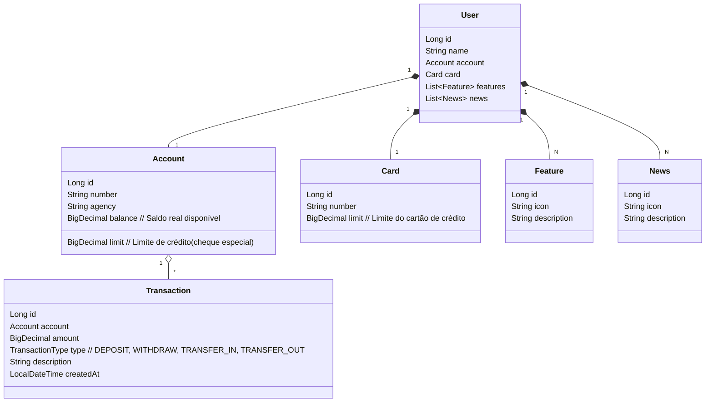

# API RESTful com Railway

> Projeto desenvolvido para aprovação no módulo do Bootcamp Santander 2025 em parceria com a DIO (Digital Innovation One) 2025.

---


## 🎯 Entrega do Desafio

Esta é a entrega atual do projeto para o desafio do Bootcamp Santander DIO 2025.

**O que já existia no início do desafio:**
- Endpoint de criação de usuário (`POST /users`)
- Endpoint de busca de usuário por ID (`GET /users/{id}`)

**Melhorias e novas funcionalidades implementadas nesta entrega:**
- Endpoints para atualização de dados do usuário:
    - PATCH para nome, cartão e conta/limite
- Endpoints de transações bancárias:
    - Depósito, saque, transferência entre contas
    - Extrato de transações por conta
- Modelagem completa de domínio, incluindo entidades Transaction, Card, Account, Feature, News
- Lógica de negócio robusta para saldo, limite, e registro de todas as movimentações

> Esta entrega representa uma evolução significativa do projeto original, agregando recursos reais de um sistema bancário e preparando a base para futuras expansões.

## 🚧 Plano de Refatoração e Futuras Atualizações

Por questões de tempo e priorização de outros projetos do bootcamp, as melhorias abaixo não foram implementadas nesta entrega, mas já estão planejadas para evolução futura da API:

- **Uso do limite como crédito (cheque especial, Pix/crédito):**
    - Implementar operações que permitam usar o limite da conta/cartão, com regras de autorização e cálculo de juros.
    - Registrar e exibir o valor utilizado do limite e os juros acumulados.
- **Fatura do cartão de crédito:**
    - Adicionar datas de fechamento e vencimento da fatura ao cartão.
    - Endpoint para pagamento de fatura, simulando pagamento em dia ou em atraso.
    - Exibir mensagens de acordo com a data de pagamento (ex: "Fatura paga em dia, parabéns!" ou "Fatura paga com atraso, nome sujo!").
- **Endpoints de consulta avançada:**
    - Consultar limite disponível, limite utilizado, extrato detalhado da fatura.
- **Autenticação e segurança:**
    - Implementar autenticação JWT para proteger endpoints sensíveis e permitir transações seguras.

> Assim que possível, estas melhorias serão implementadas para tornar a API ainda mais robusta, realista e pronta para produção.

---

Esta entrega demonstra evolução, domínio de modelagem, aplicação de regras de negócio e preocupação com a escalabilidade do sistema. O projeto está pronto para ser expandido e refatorado conforme o plano acima.

## 🚀 Tecnologias Utilizadas

- **Java 17**: Linguagem robusta e moderna (LTS).
- **Spring Boot 3**: Framework para desenvolvimento ágil de APIs.
- **Spring Data JPA**: Abstração para persistência em bancos relacionais.
- **OpenAPI (Swagger)**: Documentação interativa da API.
- **Railway**: Deploy automatizado e provisionamento de banco de dados em nuvem.
- **H2 Database**: Banco em memória para desenvolvimento.
- **PostgreSQL**: Banco relacional para produção.

## 📁 Estrutura do Projeto

- `src/main/java/com/david/`: Código-fonte principal (controllers, services, models, repositories)
- `src/main/resources/`: Configurações de ambiente (`application-dev.yml`, `application-prd.yml`)
- `build.gradle`: Gerenciamento de dependências e build
- `Procfile`: Configuração para deploy no Railway
- `README.md`: Documentação do projeto

## 🖼️ Modelagem e Domínio

O domínio foi abstraído a partir do Figma, garantindo alinhamento com o desafio proposto.

### Diagrama de Classes




## 🔗 Endpoints Principais

### User Controller
- `POST /users` — Cria um novo usuário
- `GET /users/{id}` — Busca usuário por ID
- `PATCH /users/{id}/name` — Atualiza o nome do usuário
- `PATCH /users/{id}/card` — Atualiza dados do cartão do usuário
- `PATCH /users/{id}/account` — Atualiza dados da conta (número, agência, limite)

### Transaction Controller
- `POST /transactions/deposit` — Realiza depósito em conta
- `POST /transactions/withdraw` — Realiza saque em conta
- `POST /transactions/transfer` — Realiza transferência entre contas
- `GET /transactions/statement/{accountId}` — Consulta extrato de transações da conta

- Documentação interativa: `/swagger-ui.html` após rodar a aplicação

## ⚙️ Como Executar Localmente

1. **Pré-requisitos:** Java 17+ e Gradle
2. **Clone o repositório:**
   ```sh
   git clone https://github.com/davidbs09/API-RESTful.git
   cd api-restful
   ```
3. **Execute a aplicação:**
   ```sh
   ./gradlew bootRun
   ```
4. **Acesse a documentação:** [http://localhost:8080/swagger-ui.html](http://localhost:8080/swagger-ui.html)

## ☁️ Deploy na Nuvem

O deploy é realizado automaticamente no Railway, utilizando o `Procfile` e variáveis de ambiente para configuração do banco de dados PostgreSQL em produção.
