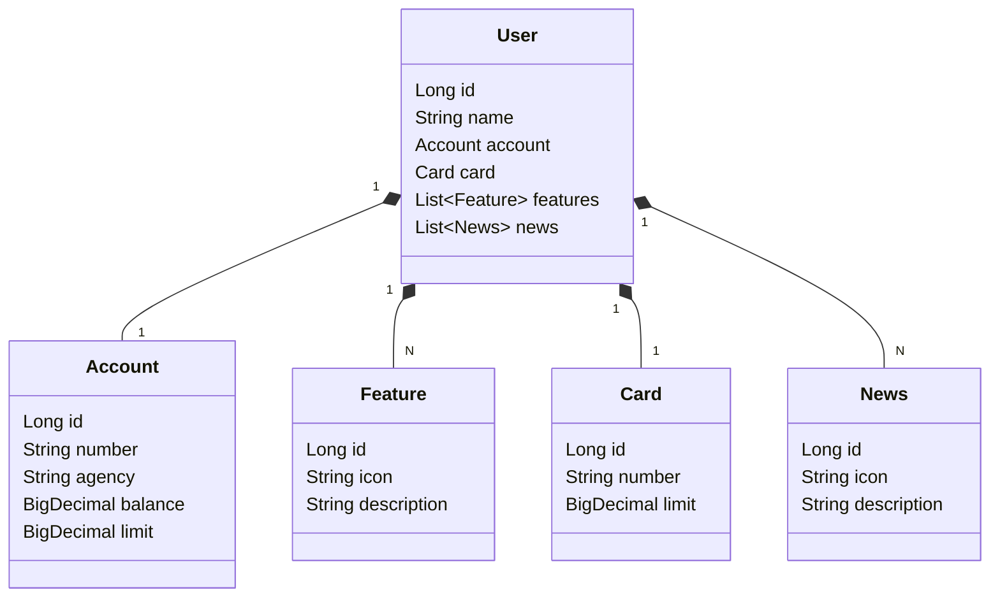

# API RESTful com Railway

> Projeto desenvolvido para aprovação no módulo do Bootcamp Santander 2025 em parceria com a DIO (Digital Innovation One) 2025.

---

## 📝 Descrição

Esta API RESTful simula operações bancárias essenciais, permitindo o gerenciamento de usuários, contas, cartões, funcionalidades e notícias. O projeto foi modelado a partir de um domínio realista, com base no [Figma do desafio](https://www.figma.com/file/0ZsjwjsYlYd3timxqMWlbj/SANTANDER---Projeto-Web%2FMobile?type=design&node-id=1421%3A432&mode=design&t=6dPQuerScEQH0zAn-1), e utiliza tecnologias modernas para garantir produtividade, qualidade e facilidade de deploy.

## 🚀 Tecnologias Utilizadas

- **Java 17**: Linguagem robusta e moderna (LTS).
- **Spring Boot 3**: Framework para desenvolvimento ágil de APIs.
- **Spring Data JPA**: Abstração para persistência em bancos relacionais.
- **OpenAPI (Swagger)**: Documentação interativa da API.
- **Railway**: Deploy automatizado e provisionamento de banco de dados em nuvem.
- **H2 Database**: Banco em memória para desenvolvimento.
- **PostgreSQL**: Banco relacional para produção.

## 📁 Estrutura do Projeto

- `src/main/java/com/david/`: Código-fonte principal (controllers, services, models, repositories)
- `src/main/resources/`: Configurações de ambiente (`application-dev.yml`, `application-prd.yml`)
- `build.gradle`: Gerenciamento de dependências e build
- `Procfile`: Configuração para deploy no Railway
- `README.md`: Documentação do projeto

## 🖼️ Modelagem e Domínio

O domínio foi abstraído a partir do Figma, garantindo alinhamento com o desafio proposto.

### Diagrama de Classes



## 🔗 Endpoints Principais

- `GET /users/{id}`: Busca usuário por ID
- `POST /users`: Cria um novo usuário
- Documentação interativa: `/swagger-ui.html` após rodar a aplicação

## ⚙️ Como Executar Localmente

1. **Pré-requisitos:** Java 17+ e Gradle
2. **Clone o repositório:**
   ```sh
   git clone https://github.com/davidbs09/API-RESTful.git
   cd api-restful
   ```
3. **Execute a aplicação:**
   ```sh
   ./gradlew bootRun
   ```
4. **Acesse a documentação:** [http://localhost:8080/swagger-ui.html](http://localhost:8080/swagger-ui.html)

## ☁️ Deploy na Nuvem

O deploy é realizado automaticamente no Railway, utilizando o `Procfile` e variáveis de ambiente para configuração do banco de dados PostgreSQL em produção.

## 🧪 Testes

O projeto inclui testes básicos de contexto com JUnit e Spring Boot.

## 📄 Licença

Projeto para fins educacionais, desenvolvido como parte do Bootcamp Santander DIO 2025.
